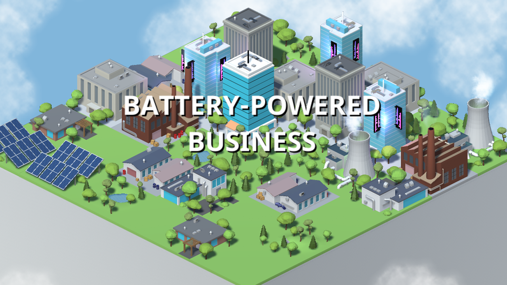

# Battery-Powered Business
This is our entry for the Ludum Dare 39 competition. We took part in the Jam and made this game from scratch in 72 hours. 
We placed 343rd overall, scoring the best in the `Graphics` category at 138th.

## About the Game

This is a puzzle game with a city-builder theme. You have to balance upgrading building (to make more money) with power draw so that you don't run out. There are challenges and random events which bring up the tension.

## Details
Builds are located in the `./Releases` folder, available for `Windows` and `Linux`.

Project created/built with Unity version `2017.1.0`.

All code and assets fall under Copyright 2017 (c) Jakub Prusak and Alex Garrity.